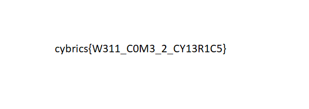

## task name
Zakukozh (Cyber, Baby, 10 pts) 

## task description
Author: Khanov Artur (awengar)

This image containing flag is encrypted with affine cipher. Scrape it

[zakukozh.bin](zakukozh.bin)

## solution
Given file is a binary which has encrypted by [affine cipher](https://en.wikipedia.org/wiki/Affine_cipher)

>The Affine cipher is a monoalphabetic substitution cipher and it can be the exact same as a standard Caesarian shift when "a" is 1. Mathematically, it is represented as e(x) = (ax + b) mod m. Decryption is a slightly different formula, d(x) = a-1(x - b) mod m.
>To encode something, you need to pick the "a" and it must be coprime with the length of the alphabet. 
http://rumkin.com/tools/cipher/affine.php

We know that a is [coprime](https://en.wikipedia.org/wiki/Coprime_integers) to alphabet.
Alphabet is 256 for binary file.
To calculate coprimes you can use [this script](https://github.com/c00c00r00c00/scripts/tree/master/coprimes):
```
$ ./coprimes.pl 256
3
5
7
9
11
13
15
17
19
21
23
25
27
29
31
33
35
37
39
41
43
45
47
49
51
53
55
57
59
61
63
65
67
69
71
73
75
77
79
81
83
85
87
89
91
93
95
97
99
101
103
105
107
109
111
113
115
117
119
121
123
125
127
129
131
133
135
137
139
141
143
145
147
149
151
153
155
157
159
161
163
165
167
169
171
173
175
177
179
181
183
185
187
189
191
193
195
197
199
201
203
205
207
209
211
213
215
217
219
221
223
225
227
229
231
233
235
237
239
241
243
245
247
249
251
253
255
```
We have 127 coprimes numbers to integer 256.
b may be take any number from 0 to 255.

So we have to brute force 127 * 256 = 32512
Or if you lazy, you can brute force 256 * 256 = 65536
No big difference : )

```
#!/usr/bin/perl
use feature 'say';

for my $aa (0..256) {
  for my $bb (0..256) {
    $str = '';
    open (FILE1, "zakukozh.bin"); 
    while ( read(FILE1,$byte,1) ) {
      $i = unpack('C', $byte);
      $c = chr( ( $aa * ( $i - $bb) ) % 256);
      $str.=$c;
    }
    close(FILE1);
    if(grep(/PNG/, $str)) {
      open(my $fh, '>', "decoded_${aa}_${bb}.png");
      $res = pack('C*', $str);
      say "$aa - $bb";
      print $fh $str;
      close($fh);
    }
  }
}
```

In few minutes the output will be:
```
$ ./solution.pl
39 - 83
67 - 33
97 - 219
239 - 89

$ ls
decoded_239_89.png      decoded_67_33.png       readme.md               zakukozh.bin
decoded_39_83.png       decoded_97_219.png      solution.pl
```

The only one which is proper PNG is `decoded_239_89.png`:


